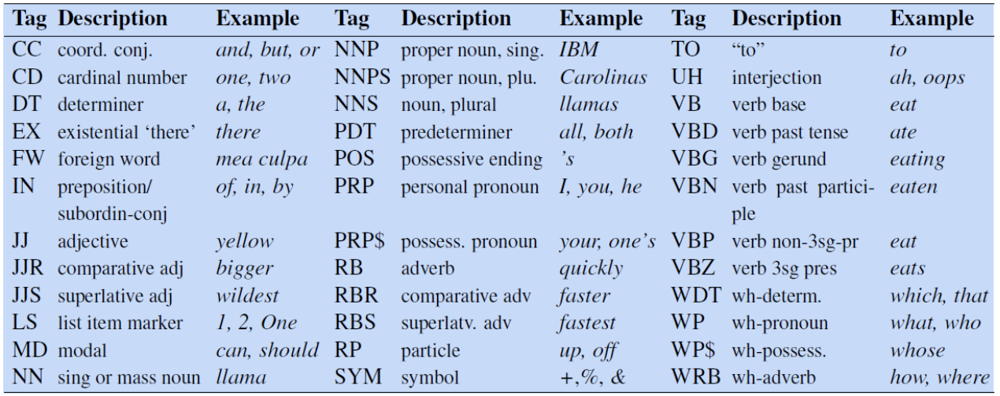

# Sequence Labelling

Sequence labelling is the task of assigning a label to each element in the input. 

## Parts of Speech (POS)

POS tagging aims to assign a parts of speech tag to each word in the input which describes its grammatical function, e.g. nouns, determiners. POS tagging is a disambiguation task as one word may have more than one possible meaning, the goal is therefore to find the best sequence of tags for the situation

POS tags can be split into three types of class:
- Open classes: New words are frequently being created or borrowed, such as nouns, verbs, adjectives, adverbs, interjections
- Closed classes: Mostly fixed vocabulary, typically function words used for structuring grammar, e.g. pronouns, adpositions, conjunctions...
- Other: symbols and punctuation

A list of POS labels is known as a Tagset. The most common of these is the Penn Treebank which contains 45 different labels. 

A good *baseline* model is to take the most common POS tag for a word, this has a surprisingly high accuracy of 92%

#### Hidden Markov Models (HMMs)

A better model is to use a Hidden Markov Model (HMM), where we are trying to find the hidden states (POS tags) based on the observed emissions (words).

HMMs make two assumptions:
- Markov Assumption: The current state only depends on the previous
- Output independence: The output observation (word) only depends on the state that produced it (the POS tag)

HMMs consist of 5 components:
- \\( Q \\): a set of \\( N \\) states
- \\( A \\): a transition probability matrix, representing the probability of moving from one state to another
- \\( O \\): a sequence of \\( T \\) observations drawn of the vocabulary
- \\( B \\): a sequence of observation (emission) probabilities, each representing the probability of an observation being generated at a state
- \\( \pi \\): the initial probability distribution for the starting state, sums to 1.

To do POS tagging we aim to *decode* the states of the HMM based on the observations

The most probable sequence of tags, using a bigram model, is defined as:

\\[  \hat{t}_{1:n} \\]

\\[ =\underset{t_{1:n}}{\text{argmax}} \prod^n_{i=1}P(w_i|t_i)P(t_i|t_{i-1}) \\]

Where:
- Emission probability \\( P(w_i|t_i) \\) is given as \\( \frac{C(t_i, w_i)}{C(t_i)} \\)
- Transition probability \\( P(t_i | t_{i-1}) \\) is given as \\( \frac{C(t_{i-1}, t_i)}{C(t_{i-1})} \\)

To calculate the most probable sequence of tags the Viterbi algorithm is used, which is an instance of dynamic programming. Viterbi works by:
- Filling a probability matrix, where each cell \\( (t, j) \\) represents the probability of that the HMM is in state \\( j \\) after seeing the first \\( t \\) observations and passing though the most probable sequence \\( q_1, \dots, q_{t-1} \\) (i.e. the max of all possible sequences) towards the current state. This is computed recursively, given the previous state through, transmission probability, and emission probability: \\( v_t(j) = \max^N_{i=1} v_{t-1}(i)A_{ij}B_j(O_t)) \\). 
- At each step keep track of the previous state
- When all cells are computed, recursively backtrack using the pointers to find the most likely sequence of states. 

## Named Entity Recognition (NER)

POS tagging can determine proper nouns, however, we may want to further disambiguate them into types of entities. Named Entities are mostly all proper nouns, such as persons and locations, however may extend to times and dates.

NER is a crucial step towards building semantic relations, extracting events and finding relations between participants. 

NERs may span over more than one word, meaning the task is now a span labelling problem rather than a word labelling problem. However, it is still implemented as a word-tag problem through the use of BIO tagging. 

BIO tagging prefixes each words NER label with its position in the NER span:
- B: indicates the beginning of an NER span
- I: indicates the inside/end of an NER span
- O: indicates the word is not within an NER span

An extension, BIOES, adds:
- E: indicates the end of a span
- S: indicates a single word NER

#### Conditional Random Fields (CRFs)

CRFs are used because we want to use Feature sets to represent words, allowing us to deal better with unknown words, which don't work well within HMMs. 

HMMs compute the best sequence (argmax Y of  P(Y|X)) based on Bayes rule and P(X|Y). In contrast CRF computes the sequence probability directly, by computing log-linear functions over local feature vectors which is aggregated and normalised to produce the global probability for the whole sequence. Weights are also created for each of the features, which are trained using gradient descent.

Linear chain CRFs are decoded using the Viterbi algorithm, like HMMs. 

[Feature vectors](../generic/word-representations.md) are a common way of embedding words for use in computations. 

