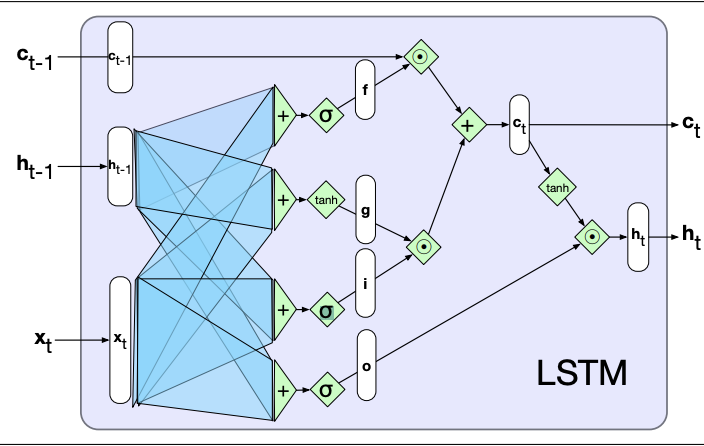
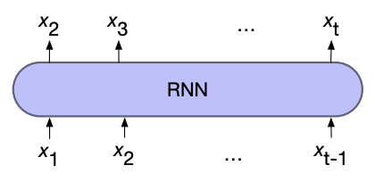
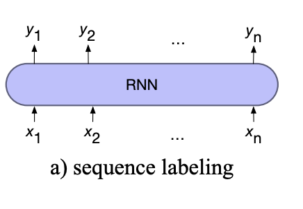
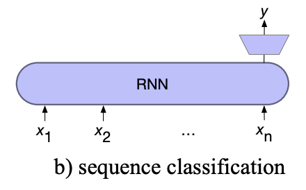
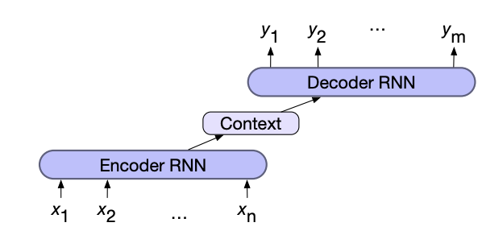

# Recurrent Neural Networks (RNNs)

Language is inherently temporal in nature, meaning we want to be able to process words in relation to words which come before it and potentially after. 

Simple recurrent networks (Elman Networks) achieve temporal processing by introducing recurrent connections. We model each input in the sequence as happening at a time \\( t \\) and the recurrent connections allow us to use the output of the hidden layer at \\( t-1 \\) as another input to the hidden layer at \\( t \\). Therefore information from previous inputs is aggregated and passed into future processing. 

The complexity of the recurrent connections is reduced by unravelling the connections through time, creating a hidden layer of individual nodes which process the input \\( t \\) and previous hidden layer \\( t-1 \\). Training is then done similar to standard neural networks, propagating the loss through the time states and back-propagating to the start, altering the weights. 

As recurrent networks rely on processing previous hidden states to calculate the current state, they can not be parallelised making large networks slow to compute. 

## Long-Short Term Memory (LSTM) cells

LSTM cells are a more sophisticated form of recurrent connections, designed to give RNNs to ability to learn and forget information as well as solve the limited information retention that simple recurrent networks have. 

This is achieved by the addition of the context output, which is also passed through time like the hidden layer outputs. 

Information is added and removed from the context and hidden vectors through the use of gates, which consist of sigmoid activations and element-wise multiplication. 

As LSTMs are modular in nature, so they can be unrolled through time like simple RNNs, just with the addition of a new input and output.

LSTMs (and its simpler version the Gated Recurrent Unit,  GRU) are the standard architecture for any recurrent based network

## RNN Architecture

#### Stacked RNNs

As RNNs can output at each hidden state we can stack multiple layers of RNNs on top of each other, using the output from one layer as the input in the layer above. 

This allows us to capture varying levels of abstraction across the levels, similar to how human perception works. Generally outperforming single layered networks

However, training costs rise quickly with the number of layers

#### Bidirectional RNNs

Many applications have access to the whole input instead of just the preceding input. In these it would make sense to also use the right-to-left context to aid in predicting. In addition one directional RNNs naturally reflect more information about the end of a sentence than the beginning, a problem bidirectional solves. 

This is achieved by training to RNNs, one processes the sequence forward and one processes it in reverse. The final hidden layer (or pooled outputs) are then combined. 

Concatenation is the most common form of combining the two outputs, however, other methods such as element-wise addition or multiplication are acceptable. 

## Recurrent Network Patterns

Recurrent networks can be assembled in multiple different ways, each searching a specific task. 

#### For Language models

To use RNNs for language models, we first input a start of sequence token (and some context) where the output (softmaxed) is then the predicted next word. At the next time step the previous prediction is used as the input, where this process repeats until a sequence length is reached or a end of sequence token is generated. 

This process of using the previous output as the next input is known as **autoregressive generation**

To train, teacher forcing is used which uses the correct input instead of the previous predicted word. This stops the model drifting to far from what is expected. To adjust the weights averaged cross entropy loss over the predicted words is used. 

*Weight tying* can reduce the number of parameters by using the same embedding matrix for the input for the output weights when predicting the next word.

#### For Sequence Labelling 

For sequence labelling, the output of each hidden layer is used to predict the label for each input token.

#### For Sequence classification

For sequence labelling, all but the last hidden layers are ignored. The last hidden layer is fed into a separate MLP+softmax classifier. 

The cross entropy loss from the classifier is used to train the whole network, known as end-to-end training

Instead of using the last hidden state we can use a pooling function to aggregate all the hidden states such as:
- element-wise mean
- element-wise max
- element-wise addition

#### For Sequence-to-Sequence

Sequence to sequence (lengths are each may be different) problems such as machine translation combine two RNNs. The first network, the **encoder**, encodes the input sequence into a single vector known as the context vector, which represents all the information the second RNN needs to know about the first. The second network, the **decoder**, combines the context vector to generate the output sequence

The *context vector* can be created either by using the final hidden state or by pooling (max, mean, add, ...) all the hidden states of the encoder. 

In addition the context vector is usually given to all states of the decoder directly, to ensure that its influence remains present thought out the entire decoder sequence. 

Training the network is done end-to-end, using the averaged cross entropy loss of the decoder outputs to adjust the weights. Teacher forcing is also used in the decoder. 

## Attention

In encoder-decoder models the context vector acts as a bottleneck, as it needs to represent everything there is to know about the input sequence in a single vector. 

Attention solves this problem by taking a weighted sum over the hidden states of the encoder as each time step in the decoder. 

Attention follows a three step process:
- Compute the relevance (score) of the previous decoder hidden state and each of the encoder hidden states.
- Softmax the scores to create a probability distribution
- Calculate the context vector for the current decoder state by using the distribution to take a weighted average over all the encoder hidden states. 

The most simple scoring function is the dot product between the two vectors (known as dot product attention), however it is also possible to use its own set of weights to score the two vectors which are trained with the rest of the model

**Cross attention** is a more sophisticated form of attention, that is similar in nature to multi head [Self Attention](transformers.md), but the queries come from the decoder and the keys and values come from the encoder. 